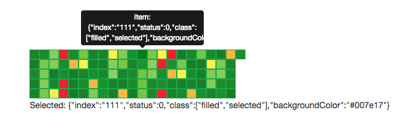

# claspin-ui
This project mainly to build a system that will have a clear show of the mass map of items in the UI and their status.
Kind of muti mosaic rects. 

Inspired by the [Facebook Monitoring Tool Claspin](https://www.facebook.com/notes/facebook-engineering/monitoring-cache-with-claspin/10151076705703920/)
([other Reference](https://techcrunch.com/2012/09/19/a-peak-at-facebooks-insanely-awesome-monitoring-tool-claspin/)).

Built using Angular as an Angular directive.

## Example
```javascript
itemList = [
  { index: '01', status: 0 },
  { index: '02', status: 1 },
  { index: '03', status: 3 },
  { index: '06', status: 2 },
  ...
  { index: '10', status: 1 }
];
```

```html
<claspin item-list="itemList" selected-item="selectedItem"></claspin>
```

## Run Example
```
bower install
npm install
```

